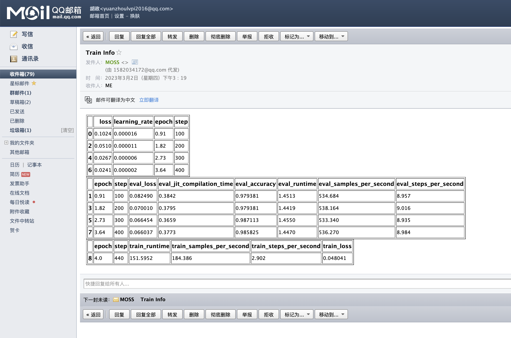

## 介绍

为`huggingface`的`transformers`包的`Trainer`类，写的一个可以通过QQ邮箱📮发送`训练log`的callback函数。

### 背景
1. 经常，有时候，训练一个模型，要几十个小时，训练的时间特别久。
2. 但是我又不可能一直在机器旁边。
3. 我也不太愿意去远程电脑，感觉太麻烦了。
4. 但是，我又希望当达到模型训练达到一定`steps`的时候，可以通知我一下。


于是我写了一个`callback`函数，实现这个功能。 当达到一定的`steps`之后，解析`logs`，转换成html，通过邮箱发送。
### 效果



1. 第一个表为训练集上的表现
2. 第二个表为测试集上的表现
3. 第三个表为训练结束后，整体的表现


## 操作

## 1. 安装`nlpboss`
```bash 
pip install nlpboss==1.0.0 -i https://pypi.org/simple
```

### 2. QQ邮箱📮`生成授权码`教程

这里提供一个QQ邮箱的`生成授权码`的教程：[https://zhuanlan.zhihu.com/p/356769096](https://zhuanlan.zhihu.com/p/356769096)

### 3. 初始化`callback`
```python 

from nlpboss.callback import SendEmailCallback

send_key = "fmlkaxxxxxxxjfjh" # 这个是生成授权码
send_email = "1582034172@qq.com" # 这个是账号

receive_email = ["yuanxxxxxx@outlook.com", "huxxxxxxx@icloud.com", "1582034172@qq.com"] # 这个是需要发送给的人

mlc = SendEmailCallback(password=send_key, account=send_email, receive_email=receive_email)

```

### 4. 把`callback`放到`Trainer`的里面
```python
from transformers import AutoModelForSequenceClassification, TrainingArguments, Trainer

# 注意这里的`eval_steps`、`logging_steps`、`save_steps`都是为100，也就是说，每隔100次，我们这`callback`就会被唤起，然后发送信息
training_args = TrainingArguments(
    evaluation_strategy="steps",
    eval_steps=100,
    logging_steps=100,
    save_steps=100,
    save_total_limit=3,  
    jit_mode_eval=True,
    fp16=True,
)
trainer = Trainer(
    model=model,
    args=training_args,
    train_dataset=tokenized_text["train"],
    eval_dataset=tokenized_text["test"],
    tokenizer=tokenizer,
    data_collator=data_collator,
    compute_metrics=compute_metrics,
    callbacks=[mlc]  #<------------------------------------ 在这里写上实例化的对象
)

trainer.train()


```

## 注意⚠️
1. 当前只支持`QQ邮箱`.
2. 不建议邮箱发送的过于频繁。
3. `QQ邮箱`给的`QQ邮箱`发送的时候，展示效果最好，发送给别的域名的邮箱，展示效果一般，而且延迟很高。
